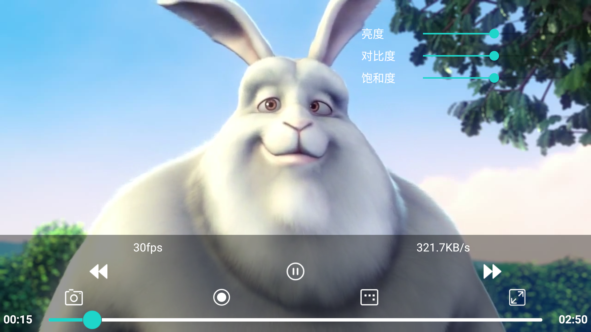

# EasyPlayerPro-Android-OpenGL

基于 [【EasyPlayerPro-Android】](https://github.com/EasyDarwin/EasyPlayerPro-Android) 播放器，增加 OpenGL 滤镜功能。

Based on [【EasyPlayerPro-Android】](https://github.com/EasyDarwin/EasyPlayerPro-Android)  player, add OpenGL filter function.

## OpenGL视频滤镜 OpenGL Video Filters

滤镜采用 `OpenGL2.0` + `GLSurfaceView` 实现，具体阅读 `GLSurfaceRenderView` 类源码。
The filter is implemented by `OpenGL2.0` + `GLSurfaceView`, read the source code of `GLSurfaceRenderView` class for details.


调用 `IjkVideoView` 的接口就可以实现三个滤镜效果：
* 亮度
* 对比度
* 饱和度

Three filter effects can be realized by calling the `IjkVideoView` interface:
* Brightness
* Contrast
* Saturation

### 加入您的项目 Add to your project 

1. Step 1. Add it in your root settings.gradle at the end of repositories:
    ```gradle
    dependencyResolutionManagement {
		repositoriesMode.set(RepositoriesMode.FAIL_ON_PROJECT_REPOS)
		repositories {
			mavenCentral()
			maven { url 'https://jitpack.io' }
		}
	}
    ```
2. Step 2. Add the dependency
    ```gradle
    dependencies {
	        implementation 'com.github.kevinvane:EasyPlayerPro-Android-OpenGL:14210703-1.4.21.0703'
	}
    ```
    
### 构建本项目 Build project

1. 克隆 Clone
    ```shell
    git clone https://github.com/kevinvane/EasyPlayerPro-Android-OpenGL
    ```
2. 构建 Build
    ```shell
    cd EasyPlayerPro-Android-OpenGL
    ./gradlew assembly
    ```

3. 引入 implementation
    ```gradle
    dependencies {
	        implementation project(':ijkplayer-java')
	}
    ```

### 如何使用 How to use
    ```java
    IjkVideoView.setBrightness(value); //设置亮度，value范围 [-1.0, 1.0], 默认为 0.0，负数调暗，正数调亮
    IjkVideoView.setContrast(value); //设置对比度，value范围 [0.0,2.0], 默认为 1.0
    IjkVideoView.setSaturation(value); //设置饱和度，value范围[0.0, 2.0], 默认为 1.0
    ```

### 预览图 Preview Image



<!--
<div align="center">

</div>
-->

### 预览Demo Preview Demo

https://github.com/user-attachments/assets/7f13ea4f-a3b1-4412-9233-508393ec8eb5

### 下载示例APK Download Sample APK
[【EasyPlayerPro-14210703-1.4.21.0703.apk】](./apk/EasyPlayerPro-14210703-1.4.21.0703.apk)


--------------------------------------


# EasyPlayerPro

EasyPlayerPro是由[EasyDarwin团队](https://www.easydarwin.org"TSINGSEE青犀开放平台")开发和维护的一款精炼、易用、高效、稳定的流媒体播放器，支持RTSP(RTP over TCP/UDP)、RTMP、HTTP、HLS、TCP、UDP等多种流媒体协议，支持各种各样编码格式的流媒体音视频直播流、点播流、文件播放！

An elegant, simple, fast android RTSP/RTMP/HLS/HTTP Player.EasyPlayer support RTSP(RTP over TCP/UDP),RTMP,HTTP,HLS，cover all kinds of streaming media！

# 版本下载
[http://app.tsingsee.com/EasyPlayerPro](http://app.tsingsee.com/EasyPlayerPro)

## 技术支持
- 邮件：[support@easydarwin.org](mailto:support@easydarwin.org) 

## 获取更多信息
EasyDarwin社区：[https://www.easydarwin.org](https://www.easydarwin.org "EasyDarwin社区")
Copyright &copy; EasyDarwin.org 2012~2024
